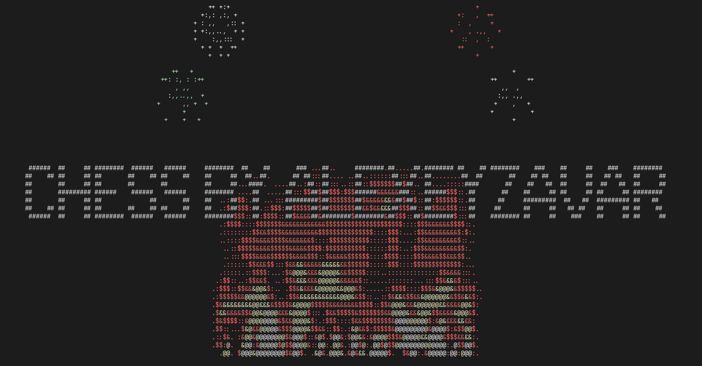

# Chess



## Task

Russian full document: [*click*](https://radolyn.com/shared/Models.pdf)

The main goal is to create a chess game that works in a console using unicode symbols. Game board should be stored as a
2 dimensional array.

## Features

- Play with AI (**alpha-beta pruning**)
- Play with friends over the network
- Stats synchronization (PvP)
- Scoreboard (PvP)

## How to run

```shell
git clone https://github.com/ZavaruKitsu/practice3_advanced
cd practice3_advanced

# setup virtual environment
python -m venv venv
pip install -r requirements.txt

# 1 terminal (run backend)
python -m uvicorn backend.main:app

# 2 terminal (run game)
cd game
python main.py
```

## Project structure

> backend

**FAST API** project that stores all user data and allows playing over the network.

Uses **SQLAlchemy** as ORM and **SQLite** as database.

> game

Main project that contains game itself.

### game

> main.py

Entry point; Startup animation.

> screens.py

Main and game frames

> .user & .user2

User data (to change user, set '**SECOND_USER**' env variable).

> consts.py

Backend URL and symbols for game.

> gameboard.py

Proxy between a screen and game source. Contains move checks for pieces.

> sources.py

Game sources:

- **LocalSource** (PvP on the computer)
- **LocalAISource** (PvE on the computer)
- **RemoteSource** (PvP using backend)

Contains all **alpha-beta pruning** related functions and arrays.

> utils.py

**calculate_yx** — converter between user input and array accessors:

- _IN_ becomes (y, x)
- _A1_ becomes (7, 0)
- _A8_ becomes (0, 0)
- _B5_ becomes (3, 1)
- _12_ becomes (1, 2)

### backend

> main.py

Entry point; run with **unicorn**.

> models.py

**SQLAlchemy** models.

> schemas.py

**Pydantic** classes for requests.

> database.py

Database connector.

> crud.py

All the **CRUD** operations.
